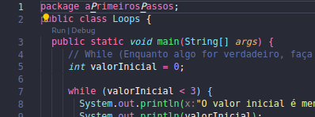
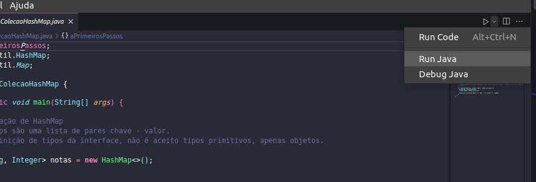

# Rascunho Java :coffee:

Este repositório foi criado com o objetivo de contribuir com o conhecimento e entendimento daqueles que, assim como eu, estão tendo seu primeiro contato com Java. Nele conterá exemplos e explicações simples de alguns dos principais conceitos e características da linguagem.

Qualquer dúvida, contribuição ou correção são extremamente bem vindas! <3

## Criação :bookmark_tabs:

Este material foi criado e adaptado a partir de uma série de aulas da Rocketseat sobre os Fundamentos do Java. A grande parte dos exemplos são de autoria da Educadora Dani Leão e outros minha. Os comentários de explicação no código são fruto do meu entendimento sobre os conteitos apresentados nas aulas, sujeitos a erros grámaticas, então não repara... :sweat_smile:

## Consumindo o conteúdo :pushpin:

Estruturei as pastas de forma que seguissem uma ordem para melhor entendimento dos conceitos, as pastas/pacotes possuem uma primeira letra minúscula antes do nome referente ao conceito tratado ali dentro, **caso esteja tendo um primeiro contato com a linguagem, siga a ordem alfabética dessas letras**.

## Executando os exemplos :computer:

Para que os exemplos sejam executados, será necessário que seu ambiente esteja preparado para tal, ou seja, possua o JDK versão 17 ou superior devidamente instalado e caso esteja usando o VScode assim como eu, as extensões de suporte para a linguagem.

### Configurando o ambiente

#### Link para JDK 17 Windows:
 
 -  https://www.oracle.com/java/technologies/downloads/#jdk17-windows

 Não uso o sistema windows para desenvolvimento, então não posso ajudar muito a partir daqui. :confused: 

#### Passo a passo de instalação Java 17 Linux (Ubuntu)

1 - Abrir um terminal (CTRL + ALT + T)  

2 - Digitar o seguinte comando  
`sudo add-apt-repository ppa:linuxuprising/java`  

Aceitar os termos, apertando ENTER  

3 - Atualizar o gerenciador de pacotes  
`sudo apt-get update`  

4 - Instalar o Java 17  
`sudo apt-get install oracle-java17-installer --install-recommends`  

5 - Pra ter certeza se o Java está instalado, digite `java -version`  

##### Observação

Se por acaso o Java não estiver sendo reconhecido no terminal, adicione o JAVA_HOME nas variáveis do seu bashrc 

`export JAVA_HOME=/usr/lib/jvm/java-17-openjdk-amd64`

#### Link para JDK 17 MacOS

- https://www.oracle.com/java/technologies/downloads/#jdk17-mac

 Não uso o sistema Mac para desenvolvimento, então não posso ajudar muito a partir daqui. :confused:

#### Extensões necessárias (VScode):

- **vscjava.vscode-java-pack**
- **vscjava.vscode-java-debug**
- **vscjava.vscode-java-dependency**
- **redhat.java**

#### Extensões não obrigatórias:

- **vscjava.vscode-maven** (Caso você queira instalar o gerenciador de pacotes maven na sua máquina)
- **vscjava.vscode-java-test**

Após todo o ambiente configurado, você pode executar os exemplos com o comando:  
`java caminho/para/o/arquivo.java`  

ou caso esteja no mesmo diretório/pacote do arquivo:  
`java NomeDoArquivo.java`  

Você também pode clicar no botão `run` localizado acima da classe main, conforme imagem:  
  

Ou no botão "play" do VScode:  
  

## Sobre o Java :mag:

Java é uma linguagem multiplataforma, no estilo WORA(Write Once, Run Anywhere), ou seja, independente de onde você escrever o código, ele poderá ser executado em qualquer outra plataforma, sem a necessidade escrever um novo código.
Java é uma linguagem compilada e mas pode-se dizer que é interpretada também, porque isso?!
Através do JavaC(Java Compiler) o código fonte é compilado, tranformando ele em um Bytecode, mas ele ainda não pode ser executado dessa forma.
JVM(Java Virtual Machine) é uma maquina virtual responsável por interpretar e executar o Bytecode, portanto, independende do sistema, se houver uma JVM instalada na máquina, a aplicação poderá ser executada trazendo então esse conceito Write Once, Run Anywhere. Então, Java é uma linguagem compilada pelo JavaC e interpretada pela JVM.

#### O que é JRE e JDK?

JRE(Java Runtime Environment) e JDK(Java Development Kit) são duas ferramentas do Java para execução e desenvolvimento respectivamente. O JRE disponibiliza somente o necessário para executar a aplicação, ele é responsável por disponibilizar a JVM, algumas bibliotecas, suporte e recursos para a execução do sistema Java, é o JRE que é instalado na máquina que irá  rodar a aplicação. O JDK como próprio nome diz, é um pacote para desenvolvimento de aplicações Java, dentro dele haverá tudo que vem com o JRE e mais algumas coisas como JavaTools, JavaC, debugger, APIs, e mais.

#### Arquitetura
A arquitetura Java é projetada para ser robusta, segura e portátil, ela possui um forte foco na organização e modularidade de código, isto é, a divisão de um programa em componentes independentes e intercambiáveis. No java pacotes(packages) são usados para organizar classes e interfaces relacionadas, elas funcionam como namespaces para evitar conflitos de nomes, um pacote é efetivamente um diretório no sistema de arquivos. Geralmente, os nomes dos pacotes são escritos com a primeira letra  minúscula por convenção (camelCase), para evitar conflito com nomes de classes ou interfaces que são escritas com a primeira letra maiúscula (PascalCase). Os arquivos de código-fonte possuem a extenção `.java` e arquivos bytecode compilado `.class`. Os arquivos de código-fonte `.java` onde serão criadas as classes, devem ter o mesmo nome da classe inserida nele, caso contrário ocorrerá um erro.
